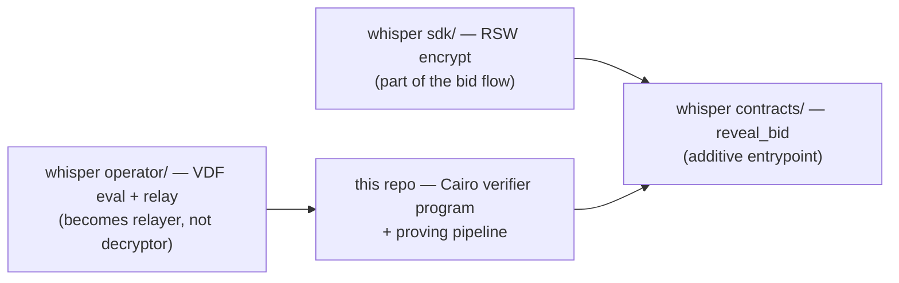

# Whisper integration

Whisper ([broody/whisper](https://github.com/broody/whisper)) is a private
sealed-bid auction protocol on Starknet. Its current 1-of-1 operator holds the
reveal key and can decrypt bids early — this VDF replaces that with **deadline
decryption**: the decryption capability materializes at the deadline, no
standing decryptor.

## The two trust axes

| Axis | Question | Mechanism |
|---|---|---|
| **Custody** | Who can move funds? | Shadow accounts / contract-gated escrow (STRK20) |
| **Reveal timing** | When do amounts become readable? | **This repo: RSW timelock + Wesolowski VDF** |

## Integration split

- **RSW encryption → whisper `sdk/`**: bidders generate the RSA modulus and
  timelock-encrypt their opening at bid time (Poseidon keystream under
  `poseidon('VDF_RSW_KEY_V1', ctx, |y|)`, with `ctx = H(auction, bid)`),
  posting the ciphertext alongside the bid commitment. It lives in the bid
  flow, not in a second package.
- **`reveal_bid` → whisper `contracts/`**: additive permissionless entrypoint,
  gated on `now >= force_reveal_after`, reusing the existing commitment check.
  No STRK20 pool-callback breakage.
- **Post-deadline VDF evaluation + relay → whisper `operator/`**: the operator
  becomes a relayer — anyone can compute the VDF and reveal.
- **Cairo verifier program + proving pipeline → this repo** (standalone).

## Why standalone

1. **Toolchain separation**: this repo needs Rust (Stwo prover, nightly) +
   scarb 2.20; whisper is Cairo + TS + pnpm.
2. **Not auction-specific**: the RFP names the whole sealed-bid class — DAO
   grants, OTC, parameter auctions. Upstreamable to
   `starkware-libs/proving`.
3. **Whisper stays product-shaped** (contracts/sdk/operator/docs).

## Production notes

- **The challenge is already bound in-program**: the verifier derives a
  251-bit prime `L` from `(N, x, |y|, T, nonce)` itself (hash-to-prime, 20
  Miller–Rabin rounds), works in the signed group `Z_N^*/{±1}` with the
  sign-canonical `|y|`, and validates `mu_n`, so a prover cannot choose `L`
  (or a bogus `mu`) to fit a forged `y`. The executable also decrypts
  in-program and outputs `[instance_hash, ctx, poseidon(ct), poseidon(pt)]` —
  the contract recomputes `instance_hash` and `poseidon(ct)` from the stored
  puzzle and ciphertext and compares `poseidon(pt)` with the bid commitment,
  binding the Stwo proof to the exact instance.
- **The bidder can prove any output on their own puzzle**: they know φ(N), so
  a VDF proof is only sound against parties without the trapdoor. Treat two
  different proven outputs for one instance as evidence of the bidder's
  misbehaviour (e.g. void the bid and slash), not the first proof as final.
- **Settlement does not need a VDF proof per bid**: the VDF guarantees the
  key is *available* to anyone at the deadline; settlement only needs a valid
  commitment opening (amount + salt). A solver decrypts offchain and submits
  the opening with a plain `reveal_bid`. The Stwo proof of the VDF
  verification is only for the permissionless/disputed path (e.g. forcing a
  no-show's bid open with onchain finality).
- **T calibration**: choose T so the deadline lands after
  `force_reveal_after` with margin; fast machines solve faster.
- **Modulus size**: 2048-bit for production (`N_LIMBS = 32`), which needs a
  serious proving machine.

Full details: `skill/references/whisper-integration-design.md` in this repo, or
`VDF_INTEGRATION_PLAN.md` in the whisper repo.
